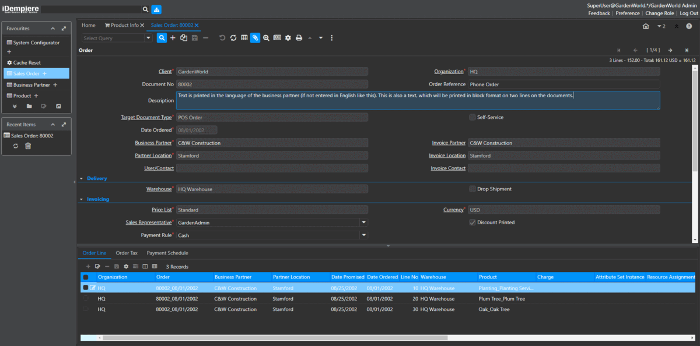

# iDempiere Theme Pack
Theme pack for iDempiere that includes lite and dark themes. With this plugin iDempiere user can switch to their prefered theme without affecting other users.

## List of themes
- Dark Blue
- Dark Cyan
- Dark Green
- Dark Purple
- Dark Red
- Dark Yellow
- Lite Blue
- Lite Cyan
- Lite Green
- Lite Purple
- Lite Red
- Lite Yellow

Since 1.1.0
- Grey
- Lightning Cloud
- Summer Midnight

## Prerequisite
- iDempiere v9

## How to install?
1. Download fragment binary of idempiere-themepack [here](https://github.com/anozimada/idempiere-themepack/releases) (jar file)
2. Download plugin binary of idempiere-themepack-utils [here](https://github.com/anozimada/idempiere-themepack-utils/releases) (jar file)
3. Install idempiere-themepack and idempiere-themepack-utils jar files [using Apache Felix Web Console](http://wiki.idempiere.org/en/Developing_Plug-Ins_-_Get_your_Plug-In_running#Apache_Felix_Web_Console)
   - Make sure the status of idempiere-themepack is Fragment and idempiere-themepack-utils is Active
   - Click Refresh Package Imports for idempiere-themepack (Warning: Any connected user will be disconnected and forced to reload the page)
4. Login to iDempiere client System and run process Set Default Theme and choose one of the theme.
5. Other user might get stuck with the old theme. You either have to clear the browser cookie or run process Switch Theme from the affected user browser.

## How to switch theme?
1. Click and choose a theme on header panel OR Run process Switch Theme.
2. Reload the page.

## How to hide a theme?
1. Login to iDempiere client System
2. Open menu Reference and search record with name "Theme Pack Themes"
3. Go to tab List Validation and disactive the record you want to hide

## How to add new theme with custom color?
to be documented
